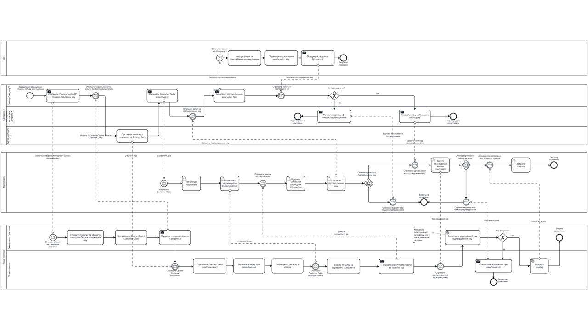

# BPMN 2.0

## 🇺🇦 Українська

Ця папка містить BPMN 2.0 модель бізнес-процесу підтвердження віку при отриманні посилки з поштомата.

Діаграма відображає взаємодію між:

- Company X;
- нашою системою управління поштоматами;
- Дією;
- користувачем.

Основний сценарій охоплює процес від створення посилки з ознакою необхідності перевірки віку до успішного або неуспішного завершення видачі.

BPMN-файл:

`age-verification-locker.bpmn`

## Preview

---

## 🇬🇧 English

This folder contains the BPMN 2.0 model of the age-verification process for parcel locker delivery.

The diagram shows the interaction between:

- Company X;
- the parcel locker management system;
- Diia;
- the user.

The main scenario covers the process from parcel creation with the age-verification requirement through successful or unsuccessful parcel collection.

BPMN file:

`age-verification-locker.bpmn`
